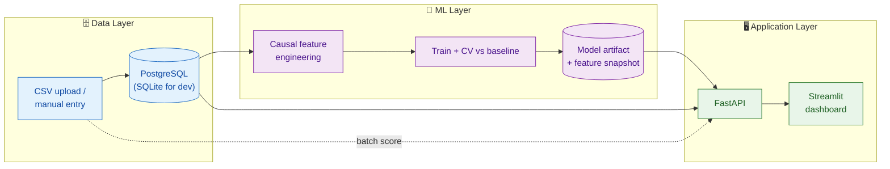

<div align="center">

# 🚧 Delivery-Delay Prediction

### Predict which construction-material deliveries will arrive late — *before they do* — and explain why.


*A 12-week hackathon MVP for BI Group — Kazakhstan's largest construction company.*
*Three layers, Data → ML → Application, running end-to-end from one command.*

</div>

---

## 🎯 The problem

On a large construction site, one late delivery of concrete, rebar, or finishing
materials cascades: idle crews, a missed pour, a slipped schedule, penalty costs.

Today the site only learns a delivery is late **when it is already late** — too
late to re-sequence the day's work or lean on the supplier. Procurement and site
managers have **no early-warning signal**, and no way to see *which* of the
hundreds of in-flight orders are the risky ones. It's all reactive.

## ✅ What we built — and why

A system that scores every delivery's **risk of arriving late, ahead of time**,
ranks them, and explains each flag — so a non-technical site manager can act on
the top red rows *this morning*.

| Capability | Why it matters |
|---|---|
| 🔴 **Risk score + red/yellow/green band**, sorted riskiest-first | Turns hundreds of orders into a short, actionable watch-list |
| 💬 **Per-delivery "why"** (top risk drivers) | People act on flags they understand — not black-box scores |
| 📊 **Always shown against an honest baseline** | Proves the ML actually adds value over "just check the supplier's track record" |
| 🧠 **Leakage-free, cold-start-safe modeling** | The numbers hold up when real data replaces the demo data |
| ⚙️ **CSV upload · retrain button · REST API** | Fits a real procurement workflow, not just a notebook |
| 🐳 **SQLite+one command → Postgres+Docker** | Laptop demo today, pilot deployment tomorrow |

## 🏗️ Architecture

Three layers with a clean seam between them. The model is trained offline and
frozen into a **self-contained artifact** so the API can score deliveries
*statelessly* — no recomputation of history per request.



**Deep dive:** [`docs/ARCHITECTURE.md`](docs/ARCHITECTURE.md) — data flow, the
stateless-prediction design decision, the DB schema, and the core ML in detail.

## 🔬 The core: making the numbers *trustworthy*

The hard part of a delivery-delay model isn't the model — it's **not fooling
yourself**. Four traps sink most attempts. Each is solved and demonstrated live
by `python3 run.py`:

| # | Trap | How we handle it | Where |
|---|------|------------------|-------|
| 1 | **Small data → overfit & fake accuracy** | Regularized model, few features, k-fold CV **with confidence intervals**, always vs. a baseline | [`ml/train.py`](ml/train.py) |
| 2 | **Leakage** — the future leaking into the past | **Causal features**: a delivery only ever sees other deliveries *completed before it was ordered* | [`ml/features.py`](ml/features.py) |
| 3 | **Cold start** — a brand-new supplier has no history | **3-level empirical-Bayes shrinkage** supplier → material×route → global; weather = seasonal normal, not forecast | [`ml/features.py`](ml/features.py) |
| 4 | **"Late" isn't universal** | Per-material **grace windows** (concrete: 0 days; finishing tiles: 3) | [`ml/labeling.py`](ml/labeling.py) |

Three ideas worth stealing:

1. **Causality is a boundary, not a metric.** Because each row's features depend
   only on its past, ordinary k-fold CV is *already* leakage-free — and `run.py`
   prints the leaky-vs-causal gap so you can see the fantasy accuracy you'd
   otherwise have shipped.
2. **Cold start is smoothing, not a special case.** `rate = (late + k·fallback)/(n + k)`
   — with zero history it *equals* the material×route fallback and never returns
   `NaN`. This same math is frozen into the artifact so `/predict` stays stateless.
3. **Weather must be honest at prediction time.** Forecasts are reliable ~10 days
   out; lead times reach 45 — so the live feature is the **seasonal normal**.

## 📈 Results (synthetic demo data, 5-fold CV)

| Metric | Baseline (supplier avg) | **Model** | Lift |
|---|:---:|:---:|:---:|
| Avg Precision (PR-AUC) | 0.732 | **0.858** | **+0.126** |
| ROC-AUC | 0.683 | **0.831** | **+0.148** |
| F1 @0.5 | 0.702 | **0.790** | **+0.088** |

Every lift's 95% CI clears zero — credible evidence the model beats the baseline.
*Numbers are on the synthetic generator; the **methodology** is the deliverable —
swap in real data before reading into any absolute figure.*

## 🚀 Quickstart

Commands use `python3` (macOS ships no bare `python`).

**One command** — ensures a trained model, then starts the API + dashboard:

```bash
./start.sh
```

<details>
<summary>Or run the steps manually</summary>

```bash
python3 -m pip install -r requirements.txt
```
```bash
python3 -m db.seed
```
```bash
python3 -m ml.train
```
```bash
python3 -m uvicorn api.main:app --reload
```
```bash
python3 -m streamlit run dashboard/app.py
```
</details>

**Full stack on Postgres (Docker):**

```bash
cp .env.example .env && docker compose up --build
```

Dashboard → http://localhost:8501 · API docs → http://localhost:8000/docs

**Verify the ML core alone:**

```bash
python3 run.py
```

## 🔌 API

| Method | Path | Purpose |
|---|---|---|
| `GET`  | `/health` | liveness + model info |
| `GET`  | `/metrics` | CV model-vs-baseline scorecard |
| `POST` | `/predict` | score one delivery → risk + drivers |
| `POST` | `/predict/batch` | score an uploaded CSV |
| `GET`  | `/deliveries/{project_id}` | a project's deliveries, risk-sorted |
| `POST` | `/train` | retrain and hot-swap the served model |

## 📁 Project structure

```
ml/         data_sim · labeling · features · baseline · train · predict · ingest   (+ artifacts/)
db/         models.py (SQLAlchemy) · database.py · seed.py
api/        main.py (FastAPI) · schemas.py
dashboard/  app.py (Streamlit)
run.py                ML-correctness demo (the four traps)
sample_deliveries.csv real-data schema template
start.sh              one-command local run
docs/ARCHITECTURE.md  the deep dive
Dockerfile · docker-compose.yml · ROADMAP.md
```

## 🗃️ Using real BI Group data

Drop a CSV in the [canonical schema](sample_deliveries.csv) and point the paths
at it — `ml/ingest.py` validates columns, parses dates, and drops bad rows:

```bash
python3 -m ml.ingest your_deliveries.csv     # validate first
python3 -m db.seed your_deliveries.csv        # load into the DB
```

Then `load_training_frame(csv_path="your_deliveries.csv")` /
`fit_and_save(csv_path=...)` to train on it. Required columns (rename
`route → route_type`): `supplier_id, material_type, route_type, quantity,
order_date, promised_date, actual_date` (+ optional `project_site`).

## 📍 Status

All six build stages complete — see [`ROADMAP.md`](ROADMAP.md). Runs on synthetic
data; the real-data seam is `ml/ingest.py`.

## 📄 License

[MIT](LICENSE) © 2026 shokkanuly
