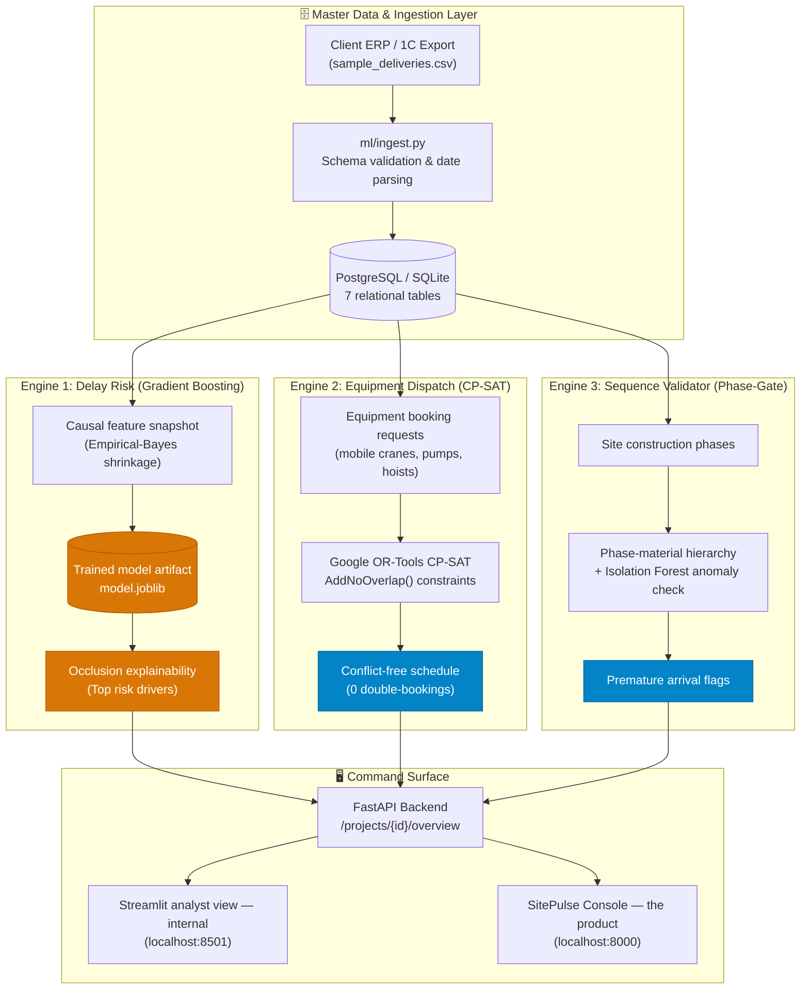

<div align="center">

# SitePulse — Enterprise Construction Logistics Platform

### Predict delivery slips, eliminate crane double-bookings, and enforce stage-gate sequencing — before site operations stall.


*Decision support for Central Asian construction holdings. Working software on synthetic data — target first pilot partner: BI Group (not yet signed).*  
*Three engines: Delay Risk (gradient boosting) · Equipment Dispatch (CP-SAT) · Sequence Check (phase rules).*

</div>

---

> [!IMPORTANT]
> ### 🛡️ Validation Status & Data Provenance
> * **Data Provenance:** All metrics and performance numbers reported below are computed on a **100% Synthetic Benchmark** ($n = 2,200$ historical delivery logs, $n = 260$ heavy machinery bookings) designed to mirror Central Asian climate patterns, long-haul supply corridors, and multi-crane site density.
> * **Current Validation Reality:** **0% live enterprise field data is connected in this demonstration build.** Statistical estimates (ML risk probabilities) and business estimates (losses avoided, ROI) are illustrative until calibrated against real supplier histories.
> * **Why the synthetic ML numbers are optimistic:** the generator encodes supplier reliability, season, route and lead time as the delay drivers, and the model learns them back. The numbers show the pipeline works end to end without leakage — not that real deliveries are this predictable.
> * **Correctness invariants (tested on every commit):** no equipment unit is double-booked, and every delivery dated before its phase start is flagged. These are properties of the code, like a calendar lock — not measures of business impact.
> * **Business numbers:** every pricing, ROI and forecast figure comes from [`business/economics.py`](business/economics.py) (also `GET /economics`), with each assumption tagged by source.
> * **Immediate Calibration Step:** Connect client 1C:Enterprise / SAP delivery receipts and crane IoT telematics via [`ml/ingest.py`](ml/ingest.py) to calibrate empirical-Bayes supplier priors during the 8-week pilot engagement. See [Pilot Proposal](docs/PILOT_PROPOSAL.md).

---

## 🎯 The Operational Problem

On a multi-hectare high-rise or commercial construction site, logistics failures compound into massive margin erosion:
1. **Unwarned Delivery Slippages:** Sites discover structural rebar or concrete is delayed only when the truck fails to arrive. Idle crews and postponed pours cascade down the critical path.
2. **Equipment Booking Clashes:** Mobile cranes, concrete pumps and hoists shared across trades and sites are booked by phone and chat; clashes surface on the day as idle crews and queued trucks.
3. **Premature Material Staging:** Finishings or facades arriving before the concrete structure is ready choke laydown yards, suffer weather degradation, and incur double-handling costs.

SitePulse provides non-technical site directors and procurement teams with **integrated decision support** to preempt all three issues every morning.

---

## ⚖️ Invariants vs. Estimates

SitePulse labels every claim by what backs it:

| Category | Claim / Metric | Value | Basis | What it does and doesn't mean |
|---|---|:---:|---|---|
| 🔵 **Correctness invariant** | **Equipment double-bookings** | **0** | OR-Tools CP-SAT `AddNoOverlap`, tested on every commit | The solver cannot output overlapping bookings on one unit — like a calendar lock. Not a measure of business impact. |
| 🔵 **Correctness invariant** | **Premature deliveries flagged** | **All rule matches** | Deterministic date rule vs. the phase schedule | Catches every delivery dated before its phase start by definition; real value depends on the schedule data being current. |
| 🟠 **Statistical estimate** | **ML Delay-Risk PR-AUC** | **0.858** | Synthetic benchmark, 5-fold CV, $n=2,200$ | Beats a supplier-average baseline (0.732) and random (0.409) on data whose drivers the generator encodes. |
| 🟠 **Statistical estimate** | **ML Delay-Risk ROC-AUC** | **0.831** | Synthetic benchmark, time-ordered causal features | Ranking ability on synthetic data; real accuracy is measured in pilot weeks 3–4. |
| 🟣 **Assumption-based** | **Losses avoided per site-year (demo Site B)** | **$103k** base | [`business/economics.py`](business/economics.py) | Conservative $46k – upside $207k. Founder assumptions, not yet measured on a site. |
| 🟣 **Assumption-based** | **Value vs. $42k/yr licence** | **2.5×** base | [`business/economics.py`](business/economics.py) | Conservative 1.1× — the product still covers its licence in the low case. |

---

## 🔬 Core ML Rigor & Class Balance

### Evaluation Set Class Balance (Base Rate)
In binary classification with imbalanced construction delays, **PR-AUC is uninterpretable without reporting the base rate (positive class prevalence):**

* **Evaluation Benchmark:** $n = 2,200$ deliveries across 5 regional project sites.
* **Positive Class ("Late" Deliveries):** 899 deliveries.
* **Evaluation Base Rate:** **40.9%** (prevalence of late shipments under material-specific grace windows).

### Model vs. Baseline Scorecard (5-fold Cross-Validation)

| Metric | Random Guess Baseline | Supplier Historical Average | **SitePulse ML Model** | Lift vs. Baseline (95% CI) | Provenance |
|---|:---:|:---:|:---:|:---:|:---:|
| **Avg Precision (PR-AUC)** | 0.409 | 0.732 | **0.858** | **+0.126** [0.082, 0.170] | 100% Synthetic Benchmark |
| **ROC-AUC** | 0.500 | 0.683 | **0.831** | **+0.148** [0.104, 0.192] | 100% Synthetic Benchmark |
| **F1 Score (@0.5 cutoff)** | 0.409 | 0.702 | **0.790** | **+0.088** [0.046, 0.130] | 100% Synthetic Benchmark |

*Notice:* The naive random model achieves a PR-AUC of 0.409 (exactly the base rate). The historical supplier average achieves 0.732. SitePulse reaches **0.858** (+0.126 lift), and every fold's 95% confidence interval strictly clears zero.

### The Number That Convinces Field Engineers (Time-Ordered Holdout)

```bash
python3 -m scripts.evidence_loop
```

Trained on the **oldest 80%** of deliveries and evaluated strictly on the **newest 20%** ($n=440$ unseen deliveries ordered in the future):

| Assigned Risk Band | Scored Deliveries | **Actually Slipped in Field** | Actionable Guidance |
|---|:---:|:---:|---|
| 🟢 **Green (Low Risk)** | 286 | **24.8%** | Proceed with standard dispatch |
| 🟡 **Yellow (Medium Risk)** | 52 | **40.4%** | Place vendor on standby notice |
| 🔴 **Red (High Risk)** | 102 | **74.5%** | Re-sequence trade crews; demand buffer delivery |

Deliveries flagged **Red** slipped **3× more often than Green** on unseen synthetic data. The bands are the right *shape* of signal for a site manager; whether real deliveries separate this cleanly is what the pilot measures.

> **Known Limits (Stated Plainly):**  
> 1. Overall recall at the 0.5 cutoff is 0.45; threshold tuning is required per site based on the cost of false alarms vs. missed delays.  
> 2. `expected_delay_days` regressor does not statistically beat predicting the mean (MAE 4.20 vs 4.19 days). Therefore, the platform flags the **probability risk score** as the trustworthy decision metric, not the day count.

---

## 🏗️ 3-Engine Architecture



---

## 💼 Pilot Engagement & Procurement

For a first construction-holding partner, we offer a structured **6–8 week dual-site pilot engagement**:

* **Scope:** 2 active sites (e.g. Site A and Site B) under shadow decision support.
* **Client Data Needed:** 6–12 months of historical purchase orders and gate arrival receipts, machinery registers, and milestone schedules. No PII or financial contract terms required.
* **Timeline to Production:** 8 weeks pilot → 2 weeks executive review → multi-site enterprise rollout.
* **Commercial Model:**
  * **Pilot Setup & Calibration:** $15k flat fee (creditable toward annual contract).
  * **Production SaaS:** $3,500 – $4,800 / site / month.
  * **Estimated losses avoided (demo Site B, per site-year):** $103k in the base case, 2.5× the licence; conservative $46k (1.1×). Founder assumptions, replaced by measured values during the pilot.

Full pilot blueprint, data dictionary, and legal SLA terms: [`docs/PILOT_PROPOSAL.md`](docs/PILOT_PROPOSAL.md).

---

## 🚀 Quickstart

Requirements: Python 3.11+ (macOS/Linux).

```bash
# 1. Start full stack (API on 8000, Dashboard on 8501)
./start.sh
```

Or run manual steps:
```bash
python3 -m pip install -r requirements.txt
python3 -m db.seed
python3 -m ml.train        # trains on data/synthetic/delay_prediction.csv (same file db.seed loads)
python3 -m uvicorn api.main:app --port 8000 --reload &
python3 -m streamlit run dashboard/app.py --server.port 8501
```

* **SitePulse Console (the product — demo this):** http://localhost:8000
* **Analyst view (Streamlit, internal):** http://localhost:8501 — model ops and exploration; not maintained as a customer surface
* **Interactive OpenAPI Specs:** http://localhost:8000/docs
* **Economics & assumptions (every pitch number):** http://localhost:8000/economics
* **Core ML Rigor Test:** `python3 run.py`
* **Full Automated Test Suite:** `pytest`

---

## 📍 Multi-Site Fictional Portfolio (Demonstration Data)

All project designations use clearly fictional placeholders until final commercial authorization:
* **Site A** (`PRJ_001`): Urban Residential Complex (Almaty) — Access Key: `DEMO-SITE-A-2026`
* **Site B** (`PRJ_002`): Commercial & Residential High-Rise (Astana) — Access Key: `DEMO-SITE-B-2026`
* **Site C** (`PRJ_003`): Embankment Towers (Astana) — Access Key: `DEMO-PILOT-KEY`
* **Site D** (`PRJ_004`): Industrial Logistics Park (Karaganda)
* **Site E** (`PRJ_005`): Regional Trade Center (Shymkent)

---

## 📁 Repository Structure

```
ml/             Causal feature engineering, empirical-Bayes shrinkage, labeling, and training
business/       Pricing, per-site ROI scenarios, unit economics and forecast — the source of every pitch number
db/             SQLAlchemy models (7 tables), database connection, and synthetic seed script
api/            FastAPI application, data sources, and Pydantic schemas
dashboard/      Internal Streamlit analyst view (model retraining, exploration); not the customer UI
static/         SitePulse Console — the one customer-facing UI, served by the API (+ design/ tokens and marks)
docs/           ARCHITECTURE.md, PRD.md, PILOT_PROPOSAL.md, INVESTOR_DECK.md, RUNBOOK.md, and ADRs
DESIGN.md       Design system: tokens, claim-badge vocabulary, type, anti-patterns (tokens in static/design/)
CHANGELOG.md    Internal build notes, UI refactoring logs, and technical milestones
start.sh        One-command startup script
```

## 📄 License

[MIT](LICENSE) © 2026 shokkanuly
