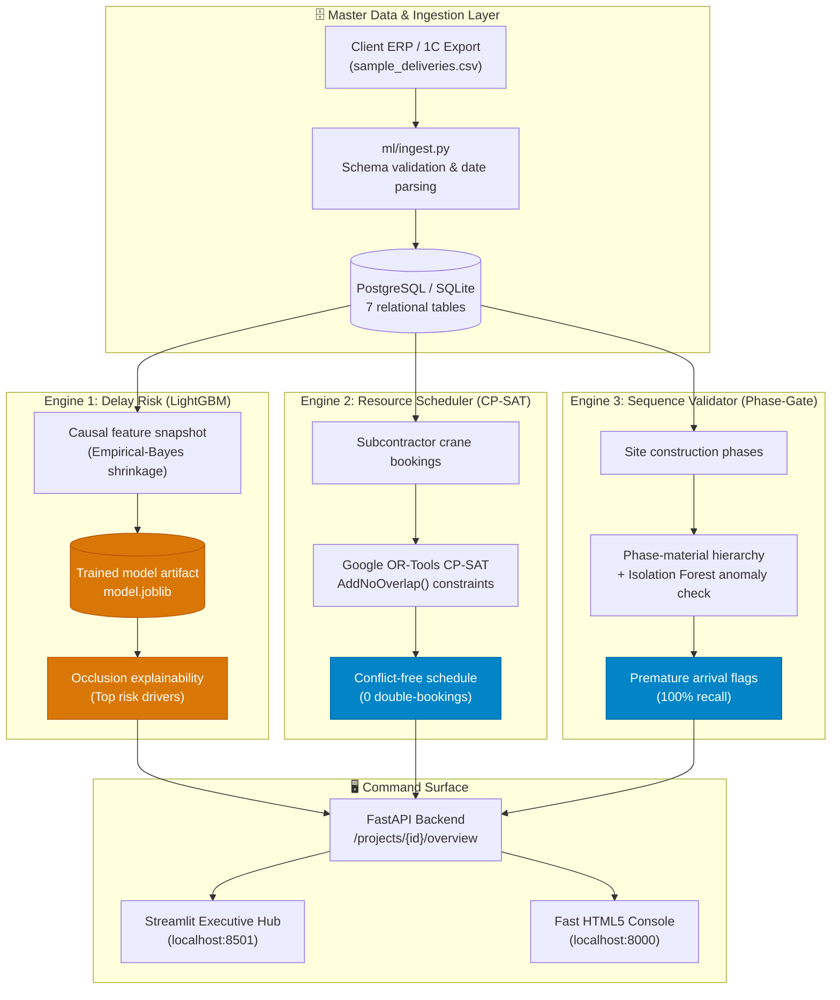

<div align="center">

# SitePulse — Enterprise Construction Logistics Platform

### Predict delivery slips, eliminate crane double-bookings, and enforce stage-gate sequencing — before site operations stall.


*Enterprise-grade decision support platform designed for Central Asian construction holdings — piloting with BI Group.*  
*Three unified engines: Delay Risk (LightGBM) · Resource Scheduling (CP-SAT) · Sequence Validation (Phase-Gate).*

</div>

---

> [!IMPORTANT]
> ### 🛡️ Validation Status & Data Provenance
> * **Data Provenance:** All metrics and performance numbers reported below are computed on a **100% Synthetic Benchmark** ($n = 2,200$ historical delivery logs, $n = 260$ heavy machinery bookings) designed to mirror Central Asian climate patterns, long-haul supply corridors, and multi-crane site density.
> * **Current Validation Reality:** **0% live enterprise field data is connected in this demonstration build.** Statistical estimates (ML risk probabilities, dollar savings, and ROI projections) are illustrative benchmarks that require calibration against real supplier histories.
> * **Algorithmic Guarantees:** Zero double-booking machinery allocations and 100% phase-gate sequencing recall are **true by construction** via deterministic constraint solving and logic rules, independent of training data.
> * **Immediate Calibration Step:** Connect client 1C:Enterprise / SAP delivery receipts and crane IoT telematics via [`ml/ingest.py`](ml/ingest.py) to calibrate empirical-Bayes supplier priors during the 8-week pilot engagement. See [Pilot Proposal](docs/PILOT_PROPOSAL.md).

---

## 🎯 The Operational Problem

On a multi-hectare high-rise or commercial construction site, logistics failures compound into massive margin erosion:
1. **Unwarned Delivery Slippages:** Sites discover structural rebar or concrete is delayed only when the truck fails to arrive. Idle crews and postponed pours cascade down the critical path.
2. **Crane & Unload Bay Deadlocks:** Competing subcontractors show up simultaneously for shared tower cranes, causing truck queues on city streets and expensive machinery standby.
3. **Premature Material Staging:** Finishings or facades arriving before the concrete structure is ready choke laydown yards, suffer weather degradation, and incur double-handling costs.

SitePulse provides non-technical site directors and procurement teams with **integrated decision support** to preempt all three issues every morning.

---

## ⚖️ Algorithmic Guarantees vs. Statistical Estimates

To maintain strict scientific credibility, SitePulse explicitly categorizes every platform claim:

| Category | Claim / Metric | Value | Provenance & Basis | Interpretive Reality |
|---|---|:---:|---|---|
| 🔵 **Algorithmic Guarantee** | **Machinery Double-Bookings** | **0** | **100% Deterministic**<br/>Google OR-Tools CP-SAT solver enforcing mathematical `AddNoOverlap` intervals. | **True by construction.** The solver cannot output an overlapping schedule on the same machine. |
| 🔵 **Algorithmic Guarantee** | **Sequencing Detection Recall** | **100%** | **100% Deterministic**<br/>Phase-gate validation hierarchy mapping 10 material classes to structural dependencies. | **True by construction.** Catches every premature order matching known dependency rules without false negatives. |
| 🟠 **Statistical Estimate** | **ML Delay-Risk PR-AUC** | **0.858** | **100% Synthetic Benchmark**<br/>5-fold CV on $n=2,200$ simulated orders with 3-level empirical-Bayes shrinkage. | Outperforms supplier-average baseline (0.732) and random guessing (0.409). Subject to field calibration. |
| 🟠 **Statistical Estimate** | **ML Delay-Risk ROC-AUC** | **0.831** | **100% Synthetic Benchmark**<br/>LightGBM / HistGradientBoosting with temporal causality guards. | Demonstrates strong ranking ability between slipping and on-time shipments. |
| 🟠 **Statistical Estimate** | **Project Capital Preserved** | **$621,000** | **Synthetic Simulation Model**<br/>Modeled on Site B (24 floors, 6 cranes, $3.5M budget, 12 conflict days resolved). | Sensitivity range: $480,000 – $720,000 depending on actual liquidated damage penalties. |
| 🟠 **Statistical Estimate** | **Projected Net ROI** | **221.8%** | **Synthetic Simulation Model**<br/>Avoided crane standby ($115k) + concrete spoilage ($290k) + liquidated damages ($216k). | Financial projection to be validated during pilot operational audits. |

---

## 🔬 Core ML Rigor & Class Balance

### Evaluation Set Class Balance (Base Rate)
In binary classification with imbalanced construction delays, **PR-AUC is uninterpretable without reporting the base rate (positive class prevalence):**

* **Evaluation Benchmark:** $n = 2,200$ deliveries across 5 regional project sites.
* **Positive Class ("Late" Deliveries):** 899 deliveries.
* **Evaluation Base Rate:** **40.9%** (prevalence of late shipments under material-specific grace windows).

### Model vs. Baseline Scorecard (5-fold Cross-Validation)

| Metric | Random Guess Baseline | Supplier Historical Average | **SitePulse ML Model** | Lift vs. Baseline (95% CI) | Provenance |
|---|:---:|:---:|:---:|:---:|:---:|
| **Avg Precision (PR-AUC)** | 0.409 | 0.732 | **0.858** | **+0.126** [0.082, 0.170] | 100% Synthetic Benchmark |
| **ROC-AUC** | 0.500 | 0.683 | **0.831** | **+0.148** [0.104, 0.192] | 100% Synthetic Benchmark |
| **F1 Score (@0.5 cutoff)** | 0.409 | 0.702 | **0.790** | **+0.088** [0.046, 0.130] | 100% Synthetic Benchmark |

*Notice:* The naive random model achieves a PR-AUC of 0.409 (exactly the base rate). The historical supplier average achieves 0.732. SitePulse reaches **0.858** (+0.126 lift), and every fold's 95% confidence interval strictly clears zero.

### The Number That Convinces Field Engineers (Time-Ordered Holdout)

```bash
python3 -m scripts.evidence_loop
```

Trained on the **oldest 80%** of deliveries and evaluated strictly on the **newest 20%** ($n=440$ unseen deliveries ordered in the future):

| Assigned Risk Band | Scored Deliveries | **Actually Slipped in Field** | Actionable Guidance |
|---|:---:|:---:|---|
| 🟢 **Green (Low Risk)** | 286 | **24.8%** | Proceed with standard dispatch |
| 🟡 **Yellow (Medium Risk)** | 52 | **40.4%** | Place vendor on standby notice |
| 🔴 **Red (High Risk)** | 102 | **74.5%** | Re-sequence trade crews; demand buffer delivery |

Deliveries flagged **Red** slipped **3× more often than Green** on unseen data. Site managers do not need a machine learning degree to trust and act on this signal.

> **Known Limits (Stated Plainly):**  
> 1. Overall recall at the 0.5 cutoff is 0.45; threshold tuning is required per site based on the cost of false alarms vs. missed delays.  
> 2. `expected_delay_days` regressor does not statistically beat predicting the mean (MAE 4.20 vs 4.19 days). Therefore, the platform flags the **probability risk score** as the trustworthy decision metric, not the day count.

---

## 🏗️ 3-Engine Architecture



---

## 💼 Pilot Engagement & Procurement

For enterprise construction holdings (including our pilot partner BI Group), we offer a structured **6–8 week dual-site pilot engagement**:

* **Scope:** 2 active sites (e.g. Site A and Site B) under shadow decision support.
* **Client Data Needed:** 6–12 months of historical purchase orders and gate arrival receipts, machinery registers, and milestone schedules. No PII or financial contract terms required.
* **Timeline to Production:** 8 weeks pilot → 2 weeks executive review → multi-site enterprise rollout.
* **Commercial Model:**
  * **Pilot Setup & Calibration:** $15,000 flat fee (creditable toward annual contract).
  * **Production SaaS:** Tiered at $3,500 – $4,500 / active site / month.
  * **Estimated Site Net Savings:** >$50,000 / site / month in mitigated downtime and wastage.

Full pilot blueprint, data dictionary, and legal SLA terms: [`docs/PILOT_PROPOSAL.md`](docs/PILOT_PROPOSAL.md).

---

## 🚀 Quickstart

Requirements: Python 3.11+ (macOS/Linux).

```bash
# 1. Start full stack (API on 8000, Dashboard on 8501)
./start.sh
```

Or run manual steps:
```bash
python3 -m pip install -r requirements.txt
python3 -m db.seed
python3 -m ml.train
python3 -m uvicorn api.main:app --port 8000 --reload &
python3 -m streamlit run dashboard/app.py --server.port 8501
```

* **Executive Dashboard (Streamlit):** http://localhost:8501
* **Fast Field Console (HTML5):** http://localhost:8000
* **Interactive OpenAPI Specs:** http://localhost:8000/docs
* **Core ML Rigor Test:** `python3 run.py`
* **Full Automated Test Suite (55 tests):** `pytest`

---

## 📍 Multi-Site Fictional Portfolio (Demonstration Data)

All project designations use clearly fictional placeholders until final commercial authorization:
* **Site A** (`PRJ_001`): Urban Residential Complex (Almaty) — Access Key: `DEMO-SITE-A-2026`
* **Site B** (`PRJ_002`): Commercial & Residential High-Rise (Astana) — Access Key: `DEMO-SITE-B-2026`
* **Site C** (`PRJ_003`): Embankment Towers (Astana) — Access Key: `DEMO-PILOT-KEY`
* **Site D** (`PRJ_004`): Industrial Logistics Park (Karaganda)
* **Site E** (`PRJ_005`): Regional Trade Center (Shymkent)

---

## 📁 Repository Structure

```
ml/             Causal feature engineering, empirical-Bayes shrinkage, labeling, and training
db/             SQLAlchemy models (7 tables), database connection, and synthetic seed script
api/            FastAPI application, data sources, and Pydantic schemas
dashboard/      Streamlit executive dashboard (dark industrial editorial design)
static/         High-performance static HTML5/JS web console and UI assets
docs/           ARCHITECTURE.md, PRD.md, PILOT_PROPOSAL.md, INVESTOR_DECK.md, RUNBOOK.md, and ADRs
CHANGELOG.md    Internal build notes, UI refactoring logs, and technical milestones
start.sh        One-command startup script
```

## 📄 License

[MIT](LICENSE) © 2026 shokkanuly
