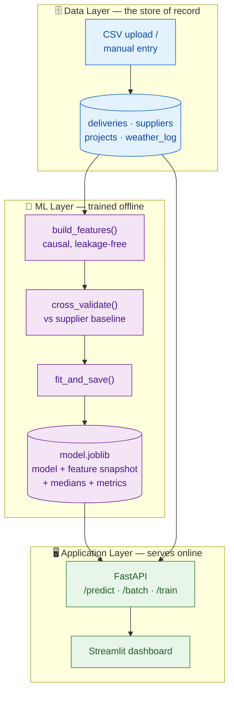
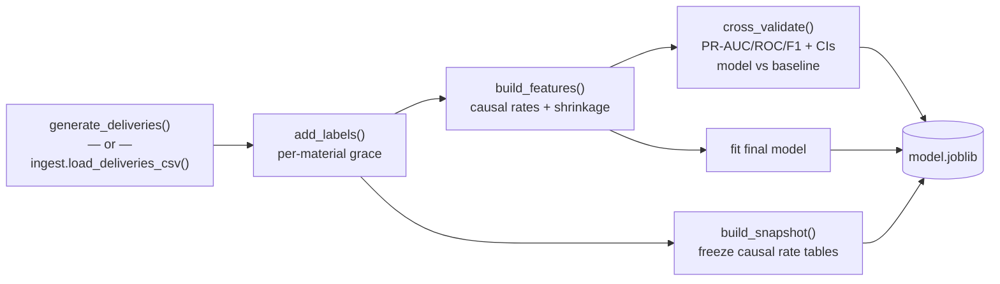
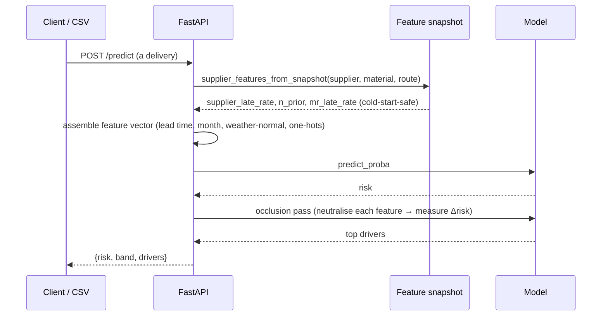
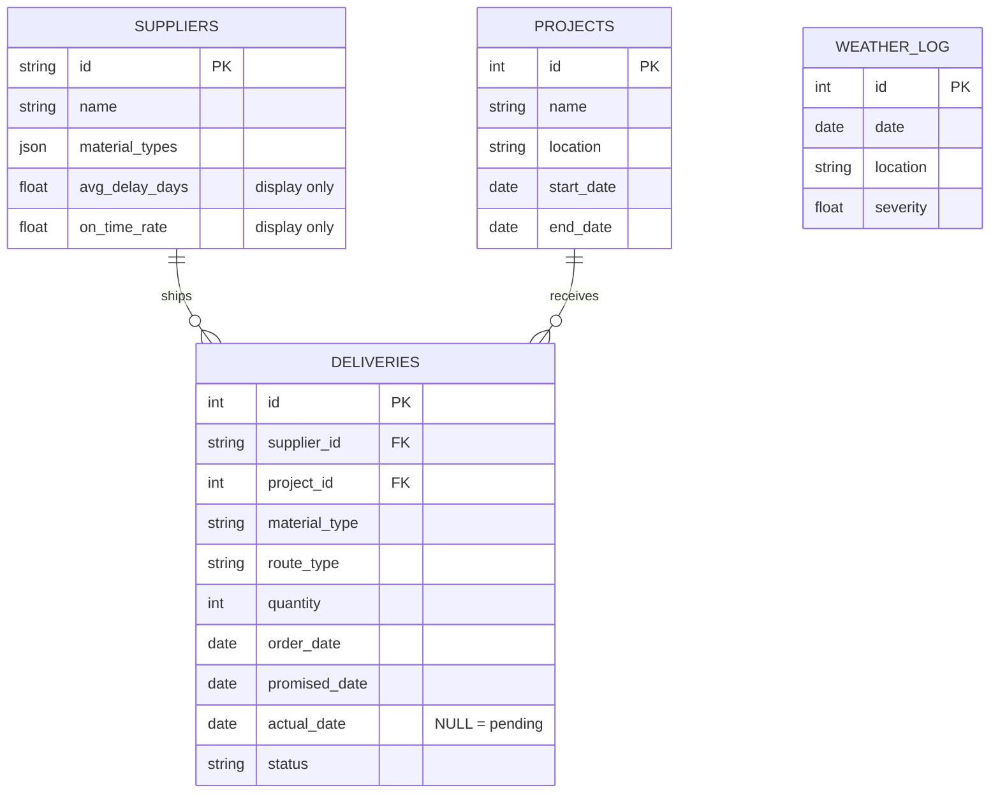
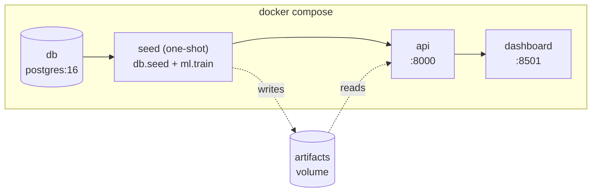

# Architecture & Core Design — SitePulse Platform

How the SitePulse construction logistics platform is architected, how data flows through it, and the reasoning behind the decisions that matter. For the quickstart and API, see the [README](../README.md); for the enterprise pilot roadmap, see [`PILOT_PROPOSAL.md`](PILOT_PROPOSAL.md).

---

## 🛡️ Validation Status & Data Provenance

| Dimension | Current Specification | Production & Calibration Seam |
|---|---|---|
| **Data Provenance** | **100% Synthetic Benchmark** ($n=2,200$ deliveries, $n=260$ machinery bookings). | Calibrated to Kazakhstan transit corridors; 0% live enterprise field data connected today. |
| **Correctness Invariants** | **No unit double-booked** (CP-SAT `AddNoOverlap`); **every delivery dated before its phase start is flagged** (date rule). | **Tested on every commit.** Properties of the code, not measures of business impact. |
| **Statistical Estimates** | **PR-AUC 0.858** (eval base rate: 40.9% late), **ROC-AUC 0.831** — on synthetic data whose delay drivers the generator encodes. | **Pipeline benchmarks, not field accuracy.** Re-measured on real ERP logs via [`ml/ingest.py`](../ml/ingest.py). |
| **Business Estimates** | Losses avoided per site-year and ROI scenarios. | **Founder assumptions** in [`business/economics.py`](../business/economics.py) (`GET /economics`). |
| **Next Step** | **8-Week Dual-Site Pilot Integration** | Ingest 6–12 months of client 1C/SAP delivery receipts to tune prior distributions. |

---

## 1. System overview

Three layers with a deliberate seam between the ML and the application:



**Boundaries that must agree (the risky seams):**

- **App ↔ ML:** the API depends only on the frozen artifact's contract
  (`feature_columns`, `snapshot`, `feature_medians`, `metrics`), never on the
  training internals.
- **App ↔ Data:** SQLAlchemy models are the single schema definition; the DB is
  swappable (SQLite ↔ Postgres) behind `DATABASE_URL`.

---

## 2. Two data flows

### Training (offline, batch)



### Prediction (online, stateless)

The key move: the API **does not** recompute a supplier's causal history per
request. Everything it needs is frozen in the snapshot.



---

## 3. The key design decision — stateless prediction via a feature snapshot

**Problem.** The model's strongest features are *causal* supplier statistics
(computed only from deliveries completed before the order). Naively, scoring a
new delivery would require pulling that supplier's whole history and recomputing
— stateful, slow, and easy to get subtly wrong.

**Options considered.**

| Approach | Verdict |
|---|---|
| **A.** Client sends the supplier stats | ❌ pushes leakage risk onto the caller |
| **B.** API recomputes from the DB per request | ❌ slow; couples API tightly to the DB; re-derives history every call |
| **C.** Freeze the causal rate tables into the artifact ✅ | fast, stateless, honest (state = training time), matches weekly retrain |

**Chosen: C.** `build_snapshot()` stores raw `sum`/`count` per supplier, per
material×route, and global — so the exact 3-level shrinkage is reproduced at
predict time by `supplier_features_from_snapshot()`. One source of truth for the
shrinkage math (`shrink()`), used by both training and serving, so they can't
drift.

**Cost, stated honestly:** a supplier who gains history *after* the last training
run is scored on slightly stale rates until the next retrain. At MVP cadence
(weekly, or `POST /train`) that's negligible.

---

## 4. The core ML, in depth

### 4.1 Label — what "late" means ([`ml/labeling.py`](../ml/labeling.py))

`delay_days = actual_date − promised_date`. A delivery is **late** when
`delay_days > grace(material)`. Grace is a business input, not a modelling choice:

| Material | Grace (days) | Rationale |
|---|:---:|---|
| ready_mix_concrete | 0 | perishable — same day or it's late |
| cement | 1 | |
| rebar, insulation | 2 | |
| bricks, tiles_finishing | 3 | finishing trades carry schedule float |

Binary (`is_late`) is the default: with hundreds–thousands of rows, a three-class
early/on-time/late split starves each class.

### 4.2 Leakage & causal features ([`ml/features.py`](../ml/features.py))

Every target-derived feature obeys one rule: **for a delivery ordered at
`order_date`, only use deliveries whose `actual_date < order_date`** — exactly
what you'd know at prediction time. Implemented per group with a sort +
`searchsorted` (O(n log n)).

Consequence: a row's features depend only on its own past, never on the
train/test split — so plain `StratifiedKFold` is already leakage-free, with no
per-fold re-encoding. `run.py` builds a deliberately *leaky* variant too and
prints the inflated score, to make the trap visible.

### 4.3 Cold start via hierarchical shrinkage ([`ml/features.py`](../ml/features.py))

A new supplier has no causal history. Instead of `NaN` or dropping the row, blend
three causal levels with empirical-Bayes shrinkage:

```
supplier_rate = (late + k·fallback) / (n + k)
    fallback(supplier)      = material×route rate
    fallback(material×route) = global rate
    fallback(global)         = fixed prior
```

`k` (default 8) is how much evidence it takes to trust the specific rate over its
fallback. With `n = 0` the formula *equals* the fallback. `supplier_n_prior` is
exposed as a feature so the model knows how much evidence backs each rate.

### 4.4 Weather, honestly

Live forecasts are trustworthy ~10 days out; lead times reach 45. So the served
feature is the **seasonal normal** (climatology) for the promised month — always
available and not a mirage. `blend_weather()` shows how to splice in a real
short-horizon forecast only when the lead time is short enough.

### 4.5 Small-data honesty ([`ml/train.py`](../ml/train.py))

- Shallow, regularized `HistGradientBoostingClassifier`, few features, no raw
  high-cardinality supplier id (LightGBM/XGBoost is an optional one-line swap).
- 5-fold CV reporting **Average Precision first** (right metric for a minority
  "late" class), plus ROC-AUC and F1, each with a Student-t 95% CI.
- Every metric is shown **paired against the supplier-average baseline**; the
  paired lift's CI is the credible "does ML help?" number.

### 4.6 Explainability via occlusion ([`ml/predict.py`](../ml/predict.py))

For each prediction, neutralise one feature at a time (set it to the training
median) and measure how far the risk drops. The features whose real values pushed
risk up the most are the drivers — model-agnostic, no SHAP dependency.

---

## 5. Database schema ([`db/models.py`](../db/models.py))



> ⚠️ `suppliers.avg_delay_days` / `on_time_rate` are **display rollups only**.
> They are deliberately *not* model features — the ML layer recomputes supplier
> rates causally. Feeding these stored aggregates into the model would leak the
> future into the past (trap #2).

---

## 6. Deployment topology ([`docker-compose.yml`](../docker-compose.yml))



`seed` runs once (waits for `db` healthy), populates Postgres and trains the
model into a shared `artifacts` volume; `api` reads that artifact; `dashboard`
talks to `api` over the compose network. Locally, none of this is needed —
`DATABASE_URL` defaults to SQLite and `./start.sh` runs the two processes
directly.

---

## 7. Retraining & real data

- **Retrain:** `POST /train` (or `python3 -m ml.train`) refits the model and the
  feature snapshot together, then hot-swaps the served artifact.
- **Real data:** `ml/ingest.py` is the single seam — validate a CSV with
  `python3 -m ml.ingest file.csv`, then point `db.seed` and
  `load_training_frame` / `fit_and_save` at it via `csv_path=`.
