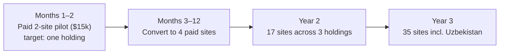

# SitePulse — LaunchZone Startup Competition Pitch Package
## Slide script, market sizing, unit economics and Q&A preparation

**Project:** SitePulse — delivery-risk and equipment-dispatch software for construction holdings
**Stage:** Working software on synthetic data. No paying customers or signed pilot yet.
**Target first pilot partner:** BI Group (not yet signed)

> **Where the numbers come from.** Every figure below is computed by
> [`business/economics.py`](../business/economics.py) and served at
> `GET /economics`. Each assumption there is tagged with its source (founder
> estimate, interview, demo site). `tests/test_pitch_claims.py` fails if this
> deck quotes a number the module does not produce. To change a number,
> change the assumption, not this file.

> **Before pitching, fill every `[FILL: …]` marker** with a fact you can show,
> or delete the sentence.

---

# SECTION 1: SLIDE-BY-SLIDE SCRIPT

## SLIDE 1: Hook & Title
* **Headline:** SitePulse: know which deliveries will slip, and dispatch your equipment without clashes.
* **Presenter script (15 sec):**
  > *"On a large Astana site, the site manager usually finds out rebar is late when the truck doesn't arrive. Meanwhile the holding's mobile cranes and concrete pumps are booked by phone and WhatsApp across several sites. SitePulse gives them a ranked list of risky deliveries and a clash-free equipment plan before the working day starts. It runs today. The data is still synthetic, and I'm here to get it onto real sites."*

---

## SLIDE 2: Problem & Customer Evidence
* **Headline:** Late materials and clashing equipment bookings stall crews and burn money.
* **The three pain points:**
  1. **Delivery slips without warning.** Supplier promises are the only signal, so idle crews and postponed pours cascade down the critical path.
  2. **Equipment booked by phone and chat.** Mobile cranes, pumps and hoists are shared across trades and sites; clashes surface on the day.
  3. **Materials arrive before their phase.** Early deliveries choke laydown areas and get damaged by weather.
* **Customer interviews** (notes: [`CUSTDEV_LOG.md`](CUSTDEV_LOG.md)):
  * 10 interviews: 7 site logistics managers and 3 chief procurement officers across regional developers. `[FILL: company names you can confirm on stage]`
  * **[FILL: N] of 7** logistics managers coordinate equipment on paper logbooks or WhatsApp groups.
  * Interviewees reported booking clashes **3–5 times per week**.
  * Interviewees said they learn of a delivery slip only when the truck fails to arrive at the gate.
  * Interviewees estimated concrete loss from queueing trucks at about **$28,000 per high-rise project**. This anchors the base case on slide 6.

---

## SLIDE 3: Market & Why Now
* **Headline:** A $7.56M beachhead in Kazakhstan and Uzbekistan, inside a $134M regional market.

| Layer | Definition | Sites | Value |
|---|---|---|---|
| **Regional market** | Major multi-storey sites across Central Asia, Caucasus and CIS × $42k/yr | 3,200 (founder estimate, `[FILL: source]`) | **$134M** |
| **Beachhead** | Active major sites of the top-15 developer holdings in KZ and UZ × $42k/yr | 180 (founder estimate, `[FILL: source]`) | **$7.56M** |
| **Year-3 target** | Paid active sites at end of year 3 | 35 (**19%** of the beachhead) | **35 sites · $1.47M ARR** |

* Sizing is bottom-up (sites × list price). The global construction-software market is not used because it isn't addressable by this product.
* **Why now:**
  1. **Material inflation.** `[FILL: cite a source for rebar/cement price rises in KZ, or cut]` Buffer waste costs more than it used to.
  2. **Street staging rules.** `[FILL: cite the akimat rule on street staging / idling trucks, or cut]`
  3. **ERP modernization.** Holdings are moving delivery records into 1C/SAP, which makes the delivery history exportable.

---

## SLIDE 4: Solution — one morning dispatch board, three modules
```
  [ 1C / SAP delivery records ] ──► Delay risk: which deliveries will slip, and why
  [ Equipment booking requests ] ─► Dispatch: which unit serves which booking, no clashes
  [ Build phase schedule ]      ──► Sequence check: which deliveries arrive before their phase
                                           │
                                           ▼
                                [ Morning dispatch board ]
```
1. **Delay risk.** A gradient-boosted classifier (scikit-learn HistGradientBoosting) ranks open deliveries by the risk they arrive late and lists the top drivers. New suppliers fall back to material-and-route history instead of failing.
2. **Equipment dispatch.** Assigns each fixed-time booking to a free unit of the right type (mobile crane, pump, hoist) across the holding's sites. It never double-books a unit, prefers nearby units, and moves at-risk bookings toward local units. When demand exceeds the fleet it drops the lowest-priority bookings and says which. It uses Google OR-Tools CP-SAT. **Limit:** it does not yet re-time bookings on a single fixed tower crane; that is the next scheduler stage.
3. **Sequence check.** Flags deliveries dated before their build phase starts, or not on that phase's material list. It is a deterministic rule, so its usefulness depends on the phase schedule being up to date.

---

## SLIDE 5: Product, Demo & Validation Status
* **Headline:** Working software. Synthetic data. Here is exactly what is and isn't proven.
* **Built:** FastAPI backend, Streamlit dashboard, web console, SQLite/Postgres, Docker Compose, GitHub Actions CI and an automated test suite. `[FILL: public demo URL, or "demo video"]`
* **Proven (tested on every commit):**
  * No equipment unit is ever double-booked. This is a correctness property of the solver, like a calendar lock; it is not a measure of business impact.
  * Every delivery dated before its phase start is flagged.
  * The delay model uses only information available at order time: a test fails if future data leaks in.
* **Not yet proven:** whether real deliveries are as predictable as the synthetic ones.
  * On synthetic data: PR-AUC 0.858 vs 0.732 for a supplier-average baseline. On a time-ordered holdout, deliveries flagged red ran late about 3× as often as green ones.
  * The synthetic generator *encodes* supplier reliability, season, route and lead time as delay drivers. So these results show the pipeline works end to end. They do not show real-world accuracy. Real accuracy is measured in pilot weeks 3–4 on the customer's own delivery history.
  * Recall at the default cutoff is 0.45. The expected-delay-days estimate does not beat predicting the average, so only the risk score is used for decisions.

---

## SLIDE 6: Business Model & Customer ROI
* **Pricing:**
  * **Pilot:** $15k flat for 8 weeks on 2 sites, credited against the first annual contract.
  * **Standard site:** $3,500 / site / month ($42k per site per year): up to 4 cranes, 500 deliveries/month.
  * **Flagship site:** $4,800 per site per month: more than 4 cranes, more than 1,000 deliveries/month. Full range: $3,500 – $4,800 / site / month.
  * **Portfolio:** 25% discount for 10+ sites.
* **Customer ROI (demo Site B: 24 floors, 6 cranes, $3.5M logistics budget):** losses avoided per site-year, compared with the $42k licence:

| Scenario | Crane idle days avoided (per crane) | Concrete loss avoided | Delay-penalty days avoided | Losses avoided | × licence | Share of logistics budget |
|---|:---:|:---:|:---:|:---:|:---:|:---:|
| Conservative | 1 | 0.5% of concrete value | 2 | **$46k** | **1.1×** | 1.3% |
| **Base** | 2 | 1% (≈ the interview figure) | 5 | **$103k** | **2.5×** | 2.9% |
| Upside | 4 | 2% | 10 | **$207k** | **4.9×** | 5.9% |

* **The claim to make:** in the base case, every $1 of licence avoids about $2.50 of losses. Even the conservative case covers the licence. These inputs are founder assumptions that the pilot replaces with measured values.

---

## SLIDE 7: Unit Economics & Financial Model

| Metric | Value | Basis |
|---|:---:|---|
| **ACV (standard site)** | **$42k** | $3,500 / site / month × 12 |
| **Gross margin** | **75%** | Hosting plus per-customer install and 1C-export support |
| **LTV per site** | **$63k** | 24-month active logistics phase × monthly gross profit; revenue stops at handover |
| **CAC per site** | **$15k** | Founder-led enterprise sale, 3–4 month cycle, including pilot support |
| **LTV : CAC** | **4.2 : 1** | |
| **CAC payback** | **5.7 months** | CAC ÷ monthly gross profit per site |
| **Break-even** | **month 16 (8 paid sites)** | Monthly opex ÷ gross profit per site, on the forecast below |

**Forecast (paid active sites at year end, list price):**
* **Year 1:** 4 sites · $168k ARR (the 2 pilot sites convert, plus 2)
* **Year 2:** 17 sites · $714k ARR (3 holdings)
* **Year 3:** 35 sites · $1.47M ARR (including Uzbekistan)

No net-revenue-retention figure is claimed: there is no revenue yet to retain. The 25% portfolio discount would lower these ARR figures.

---

## SLIDE 8: Competition & Advantage

| | SitePulse | Voyage Control | ALICE Technologies | nPlan | Procore / Fieldwire | 1C / SAP | Excel / WhatsApp |
|---|---|---|---|---|---|---|---|
| **Focus** | Delivery risk + equipment dispatch | Site delivery and gate/crane booking | AI-generated construction schedules | ML forecasting of schedule delay risk | Project and field management | ERP and accounting | Manual coordination |
| **Predicts late deliveries** | Yes (unvalidated on real data) | No | No | Schedule-level, not per delivery | No | No | No |
| **Clash-free equipment plan** | Yes, across sites | Booking calendar per site | Schedule optimization | No | Manual | No | No |
| **Local deployment / 1C exports** | Yes | No | No | No | No | Native | — |

* **Honest position:** Voyage Control already solves single-site booking. SitePulse's angle is (a) predicting which deliveries will slip and (b) dispatching a holding's shared equipment across sites, (c) deployed locally, reading 1C/Excel exports, and priced for regional budgets.
* **Moat today:** none that is durable. OR-Tools and gradient boosting are open source. The asset that would compound is **supplier-delay history per region and holding**, and it only accrues through pilots. That is why the ask is a pilot.

---

## SLIDE 9: Go-To-Market

* **Direct founder-led sales:** a 2-site pilot, measured against the base case, converted to a site contract.
* **To explore:** 1C integrator partners as a channel; general contractors requiring subcontractors to book equipment through SitePulse.

---

## SLIDE 10: Team, Next Steps & Ask
* **Founder (`shokkanuly`):** full-stack and ML engineer. Built and tested the whole platform solo.
* **Advisor:** `[FILL: name one advisor with construction-logistics experience, or delete this line]`
* **Gap we are hiring for:** enterprise sales / construction-domain co-founder.
* **Next 60 days:**
  * Days 1–14: map one holding's 1C delivery export through `ml/ingest.py`.
  * Days 15–30: retrain on 6–12 months of real history; report real PR-AUC vs their supplier averages.
  * Days 31–60: shadow-run the dispatch board on two sites; measure crane idle hours and concrete loss against the base case.
* **The ask:** one **paid 2-site pilot ($15k)** with a clause to export 6–12 months of delivery history, plus an introduction to a holding's head of logistics.

---

# SECTION 2: Q&A PREPARATION

### Q1: "Your data is synthetic. How do I know this works?"
> *"You don't yet, and neither do I. That's why I show it on slide 5. What's proven is that the software runs end to end, it can't leak future data, and it never double-books a unit. What isn't proven is that real deliveries are this predictable: my generator builds in the delay drivers the model finds. The pilot answers that in weeks 3–4 on your own 1C history, against your own supplier averages."*

### Q2: "Is BI Group already your pilot partner?"
> *"Not yet. BI Group is my target first pilot partner, and I don't have a signed agreement."* `[FILL: if you get a written commitment before the pitch, name who signed it and show it.]`

### Q3: "Voyage Control, ALICE and nPlan exist. Why you?"
> *"Voyage Control books deliveries on one site; ALICE and nPlan work at schedule level. None of them predicts which individual delivery will slip or dispatches a holding's shared equipment across sites, and none runs on-premise off 1C exports. I'd rather partner or integrate than out-feature them."*

### Q4: "How do you get $103k per site?"
> *"Base case on a 6-crane site: 2 idle days avoided per crane at $1,600 a day is $19k. Avoiding 1% concrete loss on 21,000 m³ is $24k, close to the $28k per project my interviewees reported. Five penalty days avoided at $12,000 is $60k. Total $103k, or 2.5× the licence. The conservative case is $46k, still above the licence. All of these are assumptions until the pilot measures them."*

### Q5: "Your demo shows 28 machines in 5 cities, not one tower crane."
> *"Right: today's scheduler dispatches a holding's mobile fleet (truck cranes, pumps, hoists) across sites. Re-timing hook slots on a single fixed tower crane is the next stage."*

### Q6: "You're one person. Who sells?"
> *"I do, for the first pilots; founder-led sales is the only honest option at this stage. The first hire is an enterprise-sales / construction-domain co-founder."*

### Q7: "Is this venture-scale?"
> *"The KZ/UZ beachhead is $7.56M, and 35 sites is $1.47M ARR. That's a regional business. Venture scale needs the same product in the wider CIS and MENA markets, where the same 1C/on-prem constraints apply. The pilot tells us if it's worth that push."*

### Q8: "Why wouldn't a holding build this in 1C or Excel?"
> *"They could build the booking calendar, and that's the part I'd expect them to copy. Predicting per-delivery risk from supplier history, and solving equipment assignment across sites, is data-science and optimization work their IT teams don't usually prioritize for site dispatch."*
