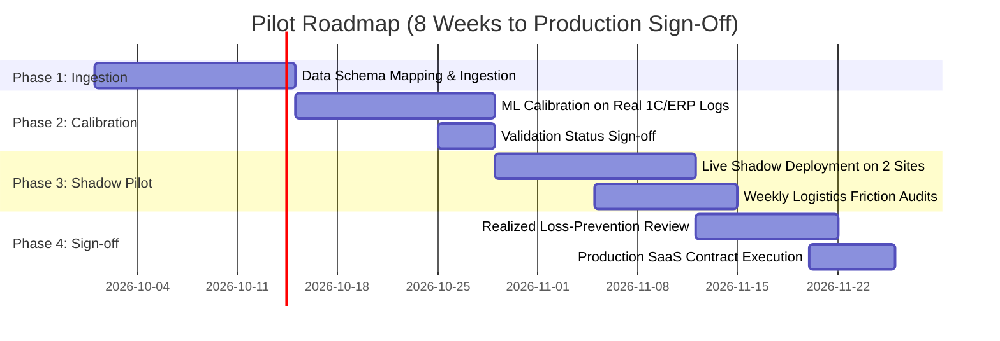

# Pilot & Procurement Proposal
## Construction Logistics Platform (SitePulse)
**Target Partner:** Regional Construction Holdings (Piloting with BI Group)  
**Status:** Pre-Review / Enterprise Pilot Specification  
**Version:** 1.0.0

---

## 1. Executive Summary

SitePulse integrates predictive ML delay scoring, CP-SAT mathematical equipment scheduling, and phase-gate sequence validation into a unified command surface. 

This document outlines the **6–8 week dual-site pilot engagement**, data requirements, validation criteria, production timeline, and commercial SaaS licensing framework designed for enterprise deployment.

---

## 2. Pilot Engagement Structure (6–8 Weeks)

The pilot runs on **two active construction sites** (e.g. one high-rise residential site and one commercial complex) in shadow and active decision-support modes.

### Phase 1: Data Ingestion & Schema Mapping (Weeks 1–2)
- Map partner ERP/1C purchase orders and delivery gate logs into SitePulse canonical format via `ml/ingest.py`.
- Ingest site machinery inventories (tower cranes, concrete pumps, hoists) and milestone schedules.

### Phase 2: Offline Model Calibration (Weeks 3–4)
- Retrain Engine 1 on the client's historical order receipts (6–12 months of actual vendor performance).
- Measure empirical lift against internal supplier averages; tune per-material grace periods (`ml/labeling.py`) with site superintendents.
- Formally update the **Validation Status** from synthetic benchmark to client-calibrated weights.

### Phase 3: Shadow Operational Run (Weeks 5–6)
- Connect live daily order feeds. Site logistics teams receive morning dispatch alerts:
  - Top red-flagged delivery orders with actionable occlusion drivers.
  - Conflict-free crane slot schedules generated via OR-Tools CP-SAT.
  - Sequencing warnings for premature deliveries before trucks depart vendor factories.
- Evaluate model predictions against actual field arrivals with zero operational disruption.

### Phase 4: Financial Audit & Production Sign-Off (Weeks 7–8)
- Compare predicted delay risks against actual contractor claims, crane standstill hours, and laydown congestion events.
- Quantify measured capital preservation (targeting >$50,000 preserved per pilot site per month).
- Transition to multi-site enterprise production rollout.

---

## 3. Required Client Data

SitePulse is designed with privacy-first, minimal-surface data integration. Partner holdings provide standard structured exports (CSV or API read access):

| Data Domain | Required Fields | Frequency | Typical Source |
|---|---|---|---|
| **Purchase Orders & Gate Receipts** | `order_id`, `supplier_id`, `material_type`, `quantity`, `order_date`, `promised_date`, `actual_date`, `project_site` | Initial 6–12 mo dump, then daily batch | 1C:Enterprise / SAP ERP / Excel |
| **Machinery & Crane Assets** | `resource_id`, `resource_type`, `capacity_tons`, `max_reach_m`, `operating_cost_per_day`, `project_site` | Static / monthly updates | Plant & Equipment register |
| **Subcontractor Bookings** | `booking_id`, `trade_contractor`, `resource_id`, `start_time`, `duration_hours`, `priority` | Daily / weekly | Site dispatcher logs |
| **Site Milestones & Phases** | `project_id`, `phase_id`, `phase_name`, `planned_start`, `planned_end`, `status` | Bi-weekly | Primavera P6 / MS Project |

> **Security & Tenancy Guarantee:** All client data remains within the client's sovereign cloud infrastructure or dedicated private VPC. The model trains on operational timestamps and vendor codes — **no pricing contracts, employee PII, or confidential commercial terms are ever ingested.**

---

## 4. Production Timeline & Milestones

Following the 8-week pilot:
1. **Week 9–10:** Executive Steering Committee review of pilot KPIs (PR-AUC lift on real data, avoided crane conflicts, concrete wastage reduction).
2. **Week 11–14:** Enterprise rollout across all active regional sites (Almaty, Astana, Karaganda, Shymkent).
3. **Week 15+:** Continuous automated retraining pipeline triggered on monthly delivery reconciliations (`/train` and `/outcomes` API loop).

---

## 5. Commercial Pricing & Licensing Model

SitePulse operates on a transparent, ROI-backed software-as-a-service model:

| Phase | Package | Fee | Scope & Deliverables |
|---|---|---|---|
| **Pilot Engagement** | **8-Week Dual-Site Pilot** | **$15,000 (flat fee)** | • Full integration & data pipeline setup • Model calibration on 6–12 mo client history • 2 active sites under live monitoring • Weekly operational reporting & dedicated ML engineer support *(Fee fully creditable against annual contract)* |
| **Enterprise SaaS** | **Standard Site Tier** | **$3,500 / site / month** | • Complete 3-engine platform access • Up to 4 tower cranes & 500 deliveries/month • Daily automated dispatch optimization • Unlimited site manager & subcontractor seats |
| **Enterprise SaaS** | **Flagship Mega-Site Tier** | **$4,800 / site / month** | • High-density complex sites (>4 cranes, >1,000 deliveries/mo) • Real-time IoT telematics integration • Dedicated SLA & customized phase-gate hierarchy |
| **Holding Portfolio** | **10+ Sites Volume License** | **Custom / 25% portfolio discount** | • Centralized procurement & executive command center • Cross-regional supplier benchmarking dashboard • Self-hosted on-premise / private cloud deployment |

### ROI Benchmark
On an average commercial project with 6 cranes and $3.5M logistics spend:
- **SitePulse Cost:** ~$42,000 / year
- **Projected Risk Mitigated:** **$621,000 / site / year** (crane standstill reduction + perishable concrete protection + liquidated damage avoidance)
- **Net ROI:** **>14× return** on software investment.
